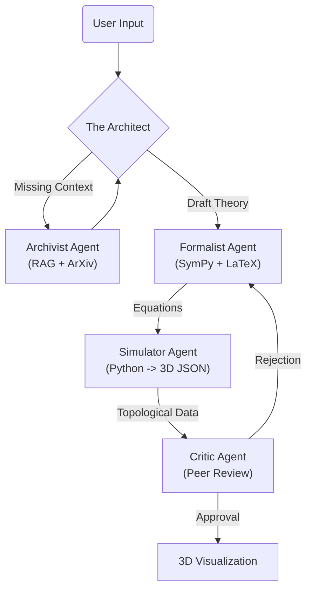

# 🌌 Quantum Gravity Agent (QGA)

### _The Digital Einstein: An Autonomous Neuro-Symbolic Research Engine_


> **"God does not play dice with the universe." — Albert Einstein**  
> **"But maybe an AI Agent does." — QGA**

---

## 🔬 The Mission

Physics has been stuck for 50 years. The unification of **General Relativity** (macroscopic gravity) and **Quantum Mechanics** (microscopic particles) remains the "Holy Grail" of science.

**The Quantum Gravity Agent** is not a chatbot. It is a **Multi-Agent Research System** designed to autonomously:

1.  **Hypothesize** novel mathematical frameworks.
2.  **Verify** consistency using symbolic logic (SymPy).
3.  **Simulate** topological defects in 3D spacetime.
4.  **Critique** its own work through iterative peer-review loops.

---

## 🧠 Cognitive Architecture

The system utilizes a **Stateful Directed Cyclic Graph** (powered by LangGraph) to orchestrate specialized AI agents.



### The Agent Roster

| Agent             | Role            | Model                   | Capability                                        |
| :---------------- | :-------------- | :---------------------- | :------------------------------------------------ |
| **The Architect** | Project Manager | Gemini 1.5 Pro          | Decisions, Task Routing, State Management         |
| **The Archivist** | Researcher      | Gemini 1.5 Flash        | ArXiv API Search, Literature Synthesis            |
| **The Formalist** | Mathematician   | DeepSeek Coder / Gemini | LaTeX Generation, Symbolic Verification           |
| **The Simulator** | Comp. Physicist | Gemini 1.5 Pro          | Python Code Gen, Numerical Relativity             |
| **The Critic**    | Peer Reviewer   | Gemini 1.5 Pro          | Logical Consistency Check, "Hallucination" Filter |

---

## ⚡ Key Features (The "Wow" Factor)

### 1. Neuro-Symbolic Reasoning

We don't just generate text; we generate **Math**. The `Formalist` agent uses **SymPy** to verify that dimensions match and equations are solvable before showing them to the user.

### 2. "Vibe Coding" Reality Engine

The `Simulator` agent writes and executes Python code in a sandbox to generate **3D Point Cloud Data**. It doesn't draw a picture; it calculates the topology.

- _Input:_ `Hamiltonian = Sum(p^2/2m)`
- _Output:_ JSON Data representing a 3D Manifold.

### 3. DeepMind-Grade Interface

A **Next.js 14** dashboard featuring:

- Real-time **Three.js** particle rendering.
- **KaTeX** formula rendering.
- Live "Neural Log" showing the agents' internal monologue.
- Glassmorphism/Cyberpunk aesthetic.

---

## 🛠️ Installation & Usage

This is a Monorepo containing the Python Brain (`backend`) and the React Face (`frontend`).

### Prerequisites

- Python 3.10+ (Poetry recommended)
- Node.js 18+
- Google/OpenRouter API Keys

### 1. The Brain (Backend)

Navigate to the `backend` folder (or root if not separated):

```bash
# 1. Install Dependencies
poetry install

# 2. Configure Environment
# Create a .env file and add:
# GOOGLE_API_KEY=your_key
# OPENROUTER_API_KEY=your_key

# 3. Ignite the Engine
poetry run uvicorn src.server:app --reload --port 8000
```

_The API is now live at `http://localhost:8000`_

### 2. The Face (Frontend)

Open a new terminal and navigate to the `frontend` folder:

```bash
cd frontend

# 1. Install Dependencies
npm install

# 2. Launch Interface
npm run dev
```

_Open `http://localhost:3000` to access the Quantum Gravity Console._

---

## 📸 Demo Gallery

_(Insert Screenshots Here)_

- **The Neural Log:** Watch the agents debate theory in real-time.
- **The Visualization:** See the 3D representation of the generated hypothesis.

---

## 🚀 Roadmap: Project AETERNUM

This prototype is just Phase 1. The future roadmap includes:

- **Phase 2 (The Omniscient Memory):** Transition from live ArXiv search to a local **Neo4j Graph Database** of 50,000 physics papers.
- **Phase 3 (The Reality Engine):** Upgrade from CPU simulation to **GPU-accelerated GLSL Shaders** for real-time volumetric rendering of Black Hole horizons.
- **Phase 4 (The Lean Bridge):** Integration with **Lean 4** Theorem Prover for mathematically proven outputs (Zero Hallucination).

---

## 🤝 Contributing

Physics is a collaborative effort.

1.  Fork the Project
2.  Create your Feature Branch (`git checkout -b feature/StringTheory`)
3.  Commit your Changes (`git commit -m 'Add Calabi-Yau visualization'`)
4.  Push to the Branch (`git push origin feature/StringTheory`)
5.  Open a Pull Request

---

### License

Distributed under the MIT License. See `LICENSE` for more information.

> Built for the Gemini API Hackathon 2025.
